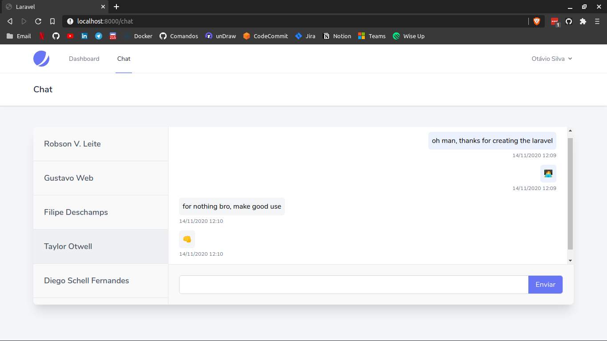

# Realtime Chat with Laravel

A realtime chat application using the Laravel 8, Jetstream, Sanctum, Inertia.js with Vue.js, Vuex and the  CSS Tailwind framework.

<p>
  
<p/>

# Start project
Run commands:

- ```composer install``` 
- ```npm install```
- ```php artisan migrate```
- ```php artisan serve```
- ```npm run dev```
- ```php artisan websocket:serve```

# Start project

First, you need to create a file at the root of the project with the name .env and copy the contents of the .env.example file. Then you must create a database with the name you want and configure the connection in the file mentioned above.
After that, run commands:

- ```composer install``` 
- ```npm install```
- ```php artisan migrate```
- ```php artisan serve```
- ```npm run dev```
- ```php artisan websocket:serve```

Lastly, open your browser on localhost: 8000, create some accounts to make the connection, log in with any of the accounts created and open an anonymous tab and log in with another user and make use of the chat.

# Did you like the project? Give a star ⭐
